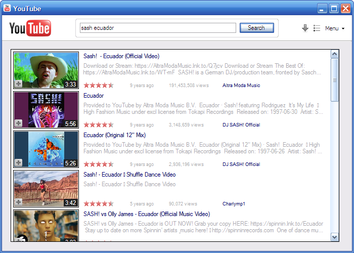

# YouTube for Windows

YouTube desktop client for YT2009 server.

[More screenshots](docs/screenshots.md)

## Why?

On some 2000s low end devices, like UMPCs, the Flash Player is barely able to play videos from YT2009 at normal frame rate. But those same videos play just fine in a desktop video player application, like Windows Media Player with the right codecs installed.

So this .NET Framework 2.0 application offers a native frontend for the server, using the YouTube Data API v2.0, that's also used by the mobile applications.

The application loads the search results for a given query, then for video playback it opens the video player application with the URL to the video file on the server.

## Features

- Search for videos
- Download videos
- Queue videos for playback into a temporary playlist
- Prioritizes downloaded videos over streaming

## How to use

- Download or build the application yourself. It's a single EXE, only depending on .NET Framework 2.0
- Launch it, go to Menu > Settings and type in the address of your yt2009 instance
- Enjoy: search for and watch videos

## Requirements

Tested on Windows XP with Windows Media Player 10, Windows 7 and Windows 10.

- Windows XP and Vista: A codec pack capable of demuxing MP4 and decoding H.264 and AAC is necessary. I've used K-Lite Codec Pack.
- Windows 7 and later: All necessary codecs are already included with WMP.

You can also configure the media player application to be MPC-HC, VLC or any other application of your choice. It has to support `http://` URLs for streaming to work, and `.m3u` playlists for the queue feature.