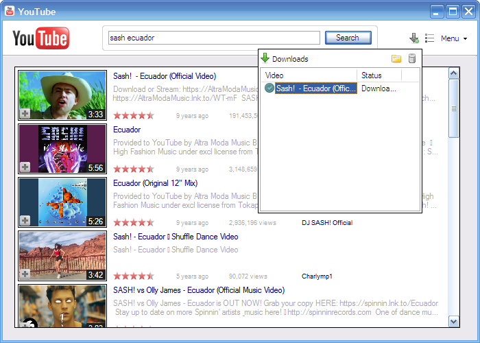
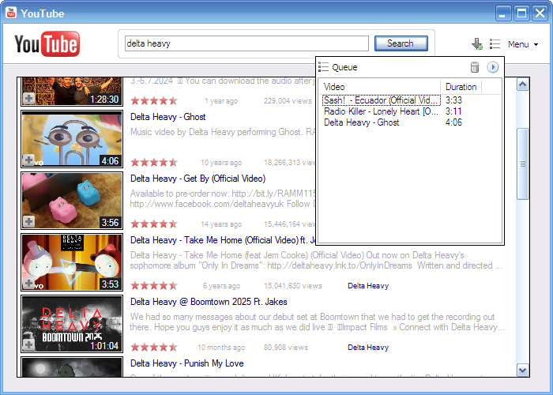
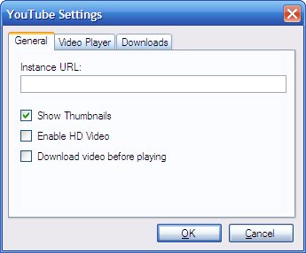
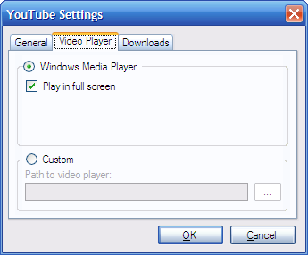
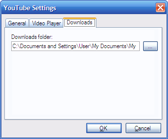
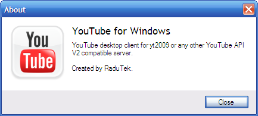

# Screenshots

Here are screenshots of the application, with descriptions of what you can see.

## Main Window

Type in a search query in the top search box, and click Search or press Enter.

To watch a video, click on the thumbnail picture, or right click on the entry and press Watch Now.

To download a video, select Download from the right click menu.

To queue a video, click the `+` icon on the thumbnail, or right click and select Queue.

You can also open the video in the browser by clicking the title link. To open the channel, click the channel name link.

In the Menu, the Settings and About options are available.

### Downloads Popup

Here all the downloaded videos will be listed. Double click to play, or use the right click menu.

### Queue Popup

Videos added to the queue will appear here. Select and press the `Delete` key on the keyboard to remove from the list.

Click the play icon to generate a playlist `.m3u` file and open it in the configured video player automatically.

## Settings Window

- Instance URL: This is the URL to the yt2009 server
- Show Thumbnails: Show or hide thumbnails in search results, to save loading time and bandwidth
- Enable HD Video: Enable playback of 720p video (if your hardware copes with it :)
- Download video before playing: Check to download the video into your downloads folder, and play it locally without streaming

### Video Player

Select the default player for watching videos.

If Windows Media Player is selected, it will be launched automatically, optionally in full screen mode.

If Custom is selected, you have to specify a path to an executable, and the video file or URL will be the 1st and only command-line argument.

### Downloads

Set the downloads folder. Defaults to `%USERPROFILE%\My Documents\My Videos` on Windows XP, and `%USERPROFILE%\Videos` on Vista and later.

## About Dialog

Pretty self-explanatory, isn't it.