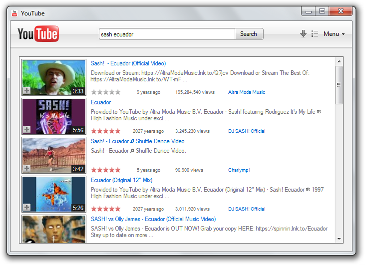
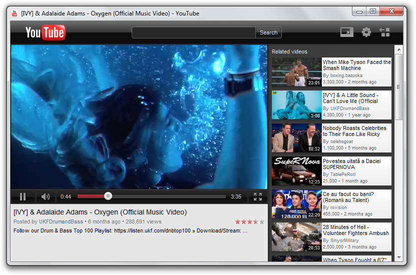
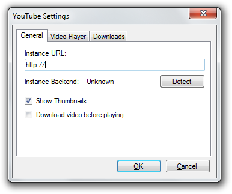
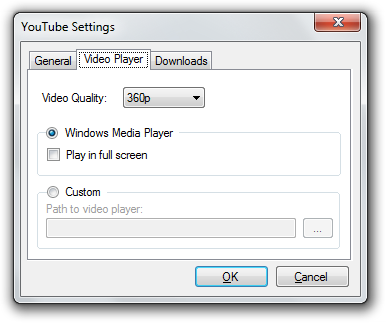
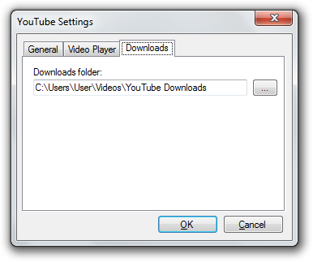
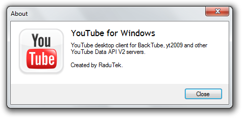

# Screenshots

Here are screenshots of the application, with descriptions of what you can see.

## Browse Window

Browse videos by search, or by selecting a feed in the left "Guide" panel. More views will come soon (channel, playlist, favorites and downloads).

To play a video, just click the title.

## Watch Window

When you click on a video title, the app switches into the watch window. You can go back to the Browse window at any time by clicking the upper right corner button.

Videos play in an embedded Windows Media Player control, with a custom UI. To toggle full screen, click the full screen button, `F` key, `F11` key or `Alt`+`Enter` keys. Press `T` or the enlarge video button at the top to make the video fill the whole window (hide description and related panels).

Press `F1` to view help about more supported keyboard shortcuts, like `0`-`9` to skip to video sections, arrow keys and more.

Click on a related video to watch it.

## Settings Window

- Instance URL: This is the URL to the server
- Instance Backend: Shows the detected instance type (BackTube, yt2009, Unknown). Click `Detect` to detect type.
<!-- - Download video before playing: Check to download the video into your downloads folder, and play it locally without streaming -->

### Video Player

**Video Quality:** Select the streaming quality and the default player for watching videos.

When using BackTube, all quality levels are available. For yt2009, only 720p and 360p are available, selecting other options will choose the next lowest quality (1080p -> 720p, 480p -> 360p).

If Windows Media Player is selected, it will be launched automatically, optionally in full screen mode.

If Custom is selected, you have to specify a path to an executable, and the video file or URL will be the 1st and only command-line argument.

**Auto play videos** - Videos start automatically when selected

**Use large controls in full screen (for tablets)** - Make playback buttons larger in fullscreen

<!-- ### Downloads

Set the downloads folder. Defaults to `%USERPROFILE%\My Documents\My Videos` on Windows XP, and `%USERPROFILE%\Videos` on Vista and later. -->

<!-- ## About Dialog

Pretty self-explanatory, isn't it. -->